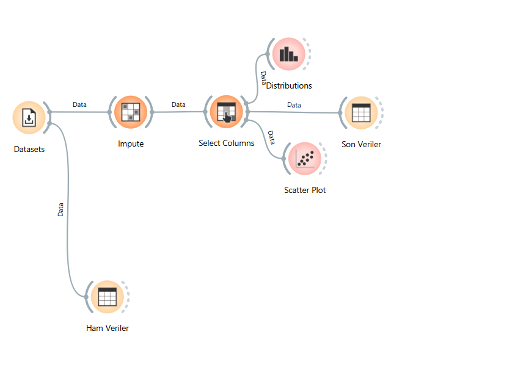
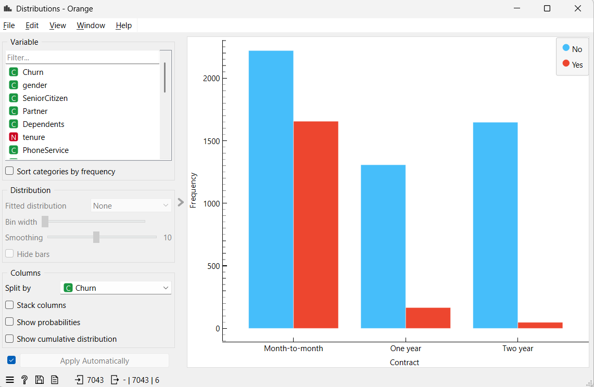
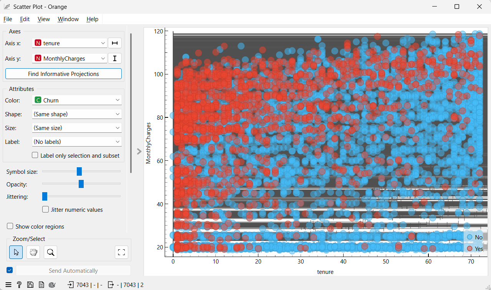
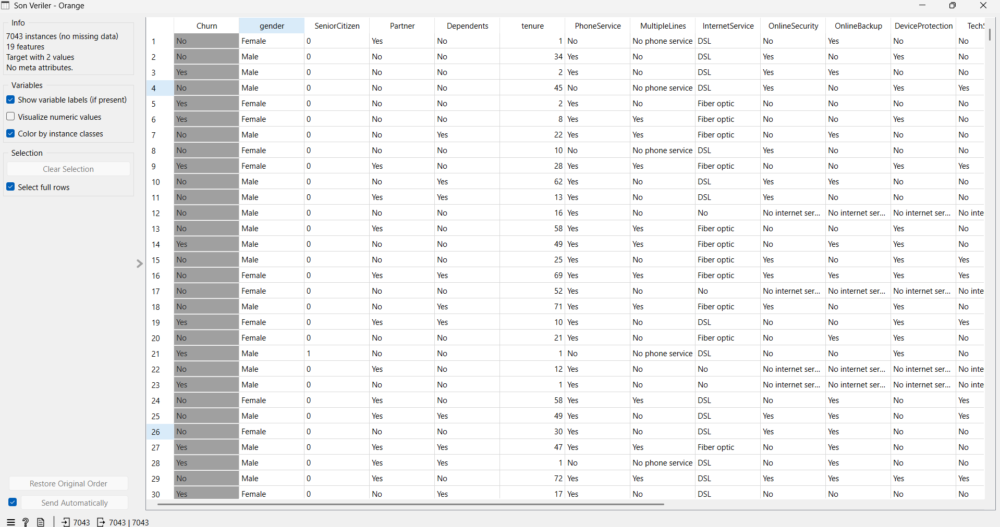

# Veri-Madenciligi-Dersi-Donem-Odevi

Verilerimizin ilk ve ham hali

Sözleşme tipine göre müşteri kaybının grafik ile gösterimi

Grafiği incelendiğimizde en yüksek müşteri kaybının 'Month-to-month'sözleşme tipine sahip müşterilerde yaşandığı görülmektedir. Uzun vadeli sözleşmeler müşteri sadakatini artırarak ayrılma oranını istatistiksel olarak belirgin bir şekilde düşürmüştür. 

Müşteri sadakati ile aylık ödeme ilişkisi

Bu serpilme (dağılım) grafiği, müşterinin şirkette geçirdiği süre, ödediği aylık fatura ve ayrılma durumu arasındaki üçlü ilişkiyi aynı anda incelememizi sağlıyor.

NaN değerlerin (Boş veya eksik olan veriler) doldurulması ve modelleme için anlamsız olan `customerID` sütununun çıkartılmasından sonraki verinin son hali:

Bu iki analizimiz, şirketin en büyük yarasının "yüksek fatura ödeyen, taahhütsüz (aylık) yeni müşteriler" olduğunu açıkça ortaya koymaktadır.
